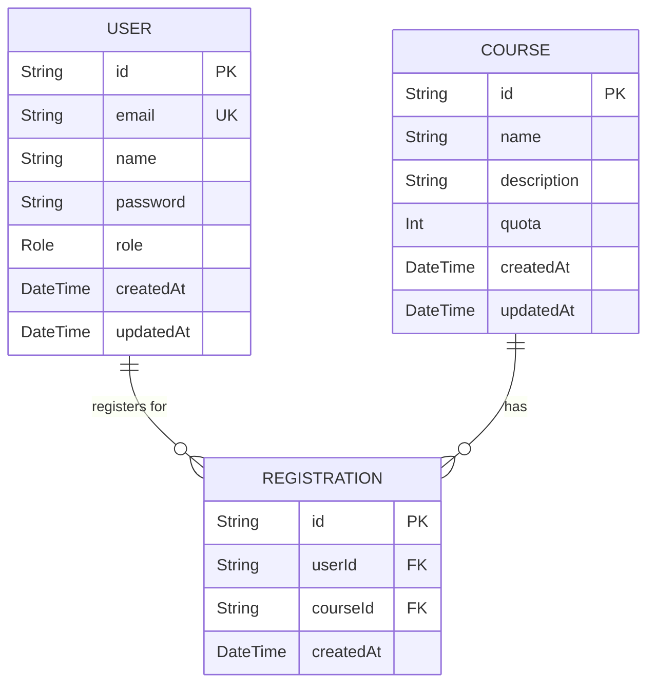

# Entity Relationship Diagram (ERD)

Dokumen ini menjelaskan relasi antar entitas (tabel) di dalam database aplikasi ini menggunakan sintaks Mermaid.

## Diagram

## Penjelasan Relasi

1.  **USER ||--o{ REGISTRATION**: Satu `USER` bisa memiliki banyak `REGISTRATION` (relasi one-to-many). Ini berarti satu pengguna bisa mendaftar di banyak kelas.

2.  **COURSE ||--o{ REGISTRATION**: Satu `COURSE` bisa memiliki banyak `REGISTRATION` (relasi one-to-many). Ini berarti satu kelas bisa memiliki banyak peserta.

3.  **Tabel `REGISTRATION`** berfungsi sebagai *join table* (tabel penghubung) antara `USER` dan `COURSE`. Tabel ini juga memiliki *unique constraint* pada pasangan `userId` dan `courseId` untuk memastikan seorang pengguna hanya bisa mendaftar di satu kelas yang sama sebanyak satu kali.
